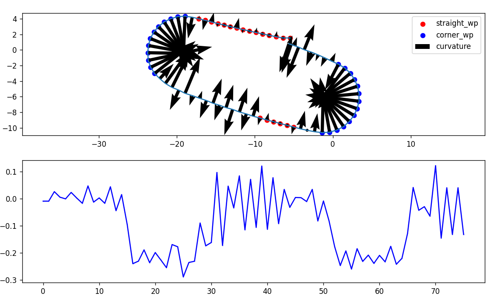
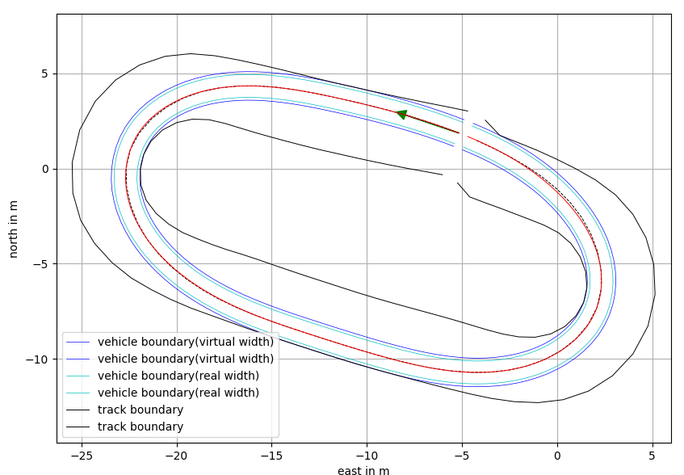
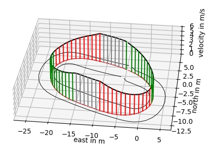

# Overview 

The planning module currently has implemented two algorithms in Python:

- gap_follow
- pure_pursuit with gnss-based pre-mapping waypoints

#### Configuration Management

All the config files for ros2 launch file are stored under `/configs` in the root directory of this repo. We provided the templates of those yaml files in `/config` for corresponding launch files. 

You need to adjust the `global_config.yaml` accordingly before you start to test in a new location. Then you can create different folders for different locations and deal with them separate by the scripts under `/scripts`. During testing, you can fine-tune the controller parameters in the yaml file under the location directory, no need to rebuild the ros package.

The details of how to use those script can be found in the pipeline section as followed.


# GNSS-based pure pursuit Pipeline

The localization info is from an EKF filter which combined the imu reading, wheel odometry and GNSS correction. The waypoints can be recorded by driving the go-kart manually.

## GNSS Projection Center defination and Sensor Calibration

NOTE: For convenience, all the command should be invoked under the root directory of the workspace `user_name@pc_name:~/gokart_ws ` , to make the relative path is correct for finding all the config files.

### 1. Modify `global_config.yaml` with the location name and projection center

The followed example will use pennovation.

```yaml
# All the yaml files will be generated under this subfolder
location: "pennovation"
# [1]For this projection, we need the latitude and longitude of the projection center. 
projection_center_latitude: 39.9416
projection_center_longitude: -75.1993
# Estimated width of the track, used in global trajectory optimization
track_width: 4.0
```

[1] To convert the WGS84 coordinate to local x, y with meter as the unit, we use [equirectangular projection](http://en.wikipedia.org/wiki/Equirectangular_projection). A reference implementation is [here.](https://stackoverflow.com/questions/16266809/convert-from-latitude-longitude-to-x-y) 

### 2. Generate config folder and yaml files for new location

```
python3 src/gokart-sensor/scripts/gerenate_yaml.py
```

This script will create a sub-directory for the location from `global_config.yaml` (if not exist) and then copy all the yaml files with the new projection center into that folder.

**Example structure:**

```js
├── configs
│   ├── global_config.yaml
│   ├── gnss_waypoints_collection.yaml
│   ├── gnss_waypoints_purepursuit.yaml
│   ├── ouster_2d_gap_follow.yaml
│   └── pennovation
│       ├── gnss_waypoints_collection.yaml
│       ├── gnss_waypoints_purepursuit.yaml
│       └── ouster_2d_gap_follow.yaml
```

### 3. IMU calibration

In the localization pipeline we assume the IMU is working in ENU frame(x axis point to the east, yaw angle is given accordingly), so we depend on the magnetometer to give use the correct ENU-based yaw angle. 

So, we need to do the calibration in NDOF mode for different location.

```
ros2 launch ros_imu_bno055 imu_calibration_launch.py
```

The calibration steps are listed [here](https://github.com/RoboticArts/ros_imu_bno055).

After calibration, the IMU calibration binary file will be stored under the same config folder we created by `generate_yaml.py`

Example structure:

```
├── configs
│   ├── global_config.yaml
│   ├── gnss_waypoints_collection.yaml
│   ├── gnss_waypoints_purepursuit.yaml
│   ├── ouster_2d_gap_follow.yaml
│   └── pennovation
│       ├── gnss_waypoints_collection.yaml
│       ├── gnss_waypoints_purepursuit.yaml
│       └── ouster_2d_gap_follow.yaml
│       └── NDOF_calibration
```


## Waypoint recording & optimization

### 1. Record the centerline of the track by manually driving the GoKart

#### **Config yaml path**

```
├── configs
│   └── pennovation
│       ├── gnss_waypoints_collection.yaml
```

#### **Package & Launch Command**

**Driver** 

septentrio_gnss_driver

```
ros2 launch septentrio_gnss_driver rover.py
```

ros2_uart_serial

```
ros2 launch serial_driver serial_driver_bridge_node.launch.py
```

ros_imu_bno055

```
ros2 launch ros_imu_bno055 imu_launch.py
```

**Waypoint collection**

```
ros2 launch pure_pursuit wp_collection.launch.py
```

#### **Note**

```
gnss_to_local_node:
  ros__parameters:
    ...
    map_ori_path: /<user_workspace>/src/gokart-sensor/configs/pennovation/map_ori.csv
    set_origin: true
    ...
```

If `set_origin` is true,`gnss_to_local_node` will take the first GNSS msg published by `ekf_gnss` node and save it into map_ori_path. This waypoint will be used as the origin of the map. If `set_origin` is false, `gnss_to_local_node` will load the map origin from map_ori_path and use it as the origin of the map.


#### Visualize the recorded centerline
After the waypoints are recorded, it can be visualize using the `visualize_centerline.py` script. This script will also generate the corner and overtake index numpy file. As seen on the figure, the manually recorded waypoints is not very smooth.

```
python3 src/gokart-sensor/scripts/visualize_centerline.py
```




**Purepursuit**

```
ros2 launch pure_pursuit purepursuit.launch.py
```


### 2.(Optional) TUM global raceline optimization


#### Overview
we use the [TUMFTM global_racetrajectory_optimization](https://github.com/TUMFTM/global_racetrajectory_optimization). All the related codes are under `/scripts/trajectory_generator`. It is a simplified version only contains the code related to min-curvature optimizaiton.


#### Dependencies

TUM global raceline optimization requires numpy==1.18.1 and scipy==1.3.3 which are both outdated. However, installing them does not cause trouble for other scripts yet, so we will just keep those versions.

```
pip3 install -r src/gokart-sensor/scripts/trajectory_generator/requirements.txt
```


#### Visualize the recorded centerline

We assume the waypoints collected in the first step are the centerline of the track, which can be scattered and discontinuous. To further optimize the waypoints. run the same command as in previous section, and the script will generate a file named `<location>_wp_w_width.csv` under `/scripts/trajectory_generator/outputs`, for the global trajectory optimization. The width of the track should be defined and read from `global_config.yaml`.


```
python3 src/gokart-sensor/scripts/visualize_centerline.py
```


#### Run trajectory optimization

```
python3 src/gokart-sensor/scripts/trajectory_generator/main_globaltraj.py
```

The output of the script is a `optim_traj.csv` file under the config folder:

```
├── configs
│   └── pennovation
│       ├── optim_traj.csv
```

And you should see the following figures of the optimized trajectory with velocity profile:






```
python3 src/gokart-sensor/scripts/visualize_optim_raceline.py
```


### 3.(Optional) Lane generation for lane-switcher based obstacle avoidance


